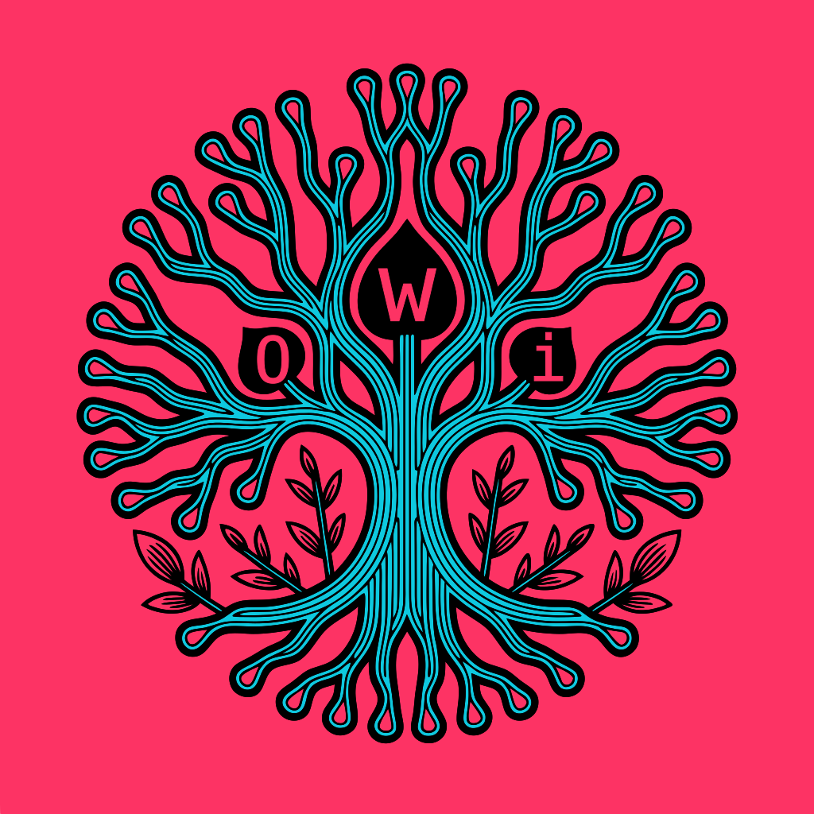

  
   
  <strong>Owi: Seamless bug-finding for Wasm, C, C++, Rust and Zig</strong>

 

[![build-badge]][build status] [![coverage-badge]][code coverage]

**Owi** is an automatic bug-finding tool for C, C++, Go, Rust and Zig. It can also be used for test-case generation, proof of programs and solver-aided programming. It works at the WebAssembly level, and thus incidentally provides a Wasm Swiss Army Knife: a formatter, an interpreter, a validator, a converter between `.wasm` and `.wat`, but also a fuzzer! Owi being written in OCaml, you can also use it as an OCaml library for many purposes.

### Key resources

- 📘 [User Manual](https://ocamlpro.github.io/owi)
  - [Install Owi](https://ocamlpro.github.io/owi/installation.html)
  - [Quickstart](https://ocamlpro.github.io/owi/symex/quickstart.html)
- 💬 [Zulip community](https://owi.zulipchat.com)
- [List of supported Wasm proposals](https://webassembly.org/features)
- [Changelog](./CHANGES.md)
- [Hacking on Owi](./HACKING.md)

### Explanations

  
List of talks

- [september 2023]: [ICFP OCaml track] @ The Westin Seattle - Seattle
- [october 2023]: Wasm Research Day organized by the [WebAssembly Research Center] @ Google - Munich
- april 2024: [OUPS (OCaml UserS in Paris)] @ Sorbonne Université - Paris
- [november 2024]: [LVP working group] day of the [GdR GPL] @ Université Paris-Cité - Paris
- [december 2024]: Léo Andrès' PhD defense @ Université Paris-Saclay - Gif-sur-Yvette
- january 2025: [JFLA 2025] @ Domaine de Roiffé - Roiffé
- [february 2025]: [Wasm Research Day 2025] (remote) @ Fastly - San Francisco
- february 2025: [PPS Seminar] @ Université Paris-Cité - Paris
- may 2025: [15th MirageOS hack retreat] @ Priscilla Queen of the Medina - Marrakech
- june 2025: [\<Programming\> 2025] @ Faculty of Mathematics and Physics, Charles University - Prague
- june 2025: [Dagstuhl Seminar 25241 - Utilising and Scaling the WebAssembly Semantics] @ Leibniz-Zentrum für Informatik - Dagstuhl
- october 2025: [Wasm Research Day October 2025] @ Google - Munich
- february 2026: [JFLA 2026] @ Hôtellerie du Couvent - Vosges du Nord
- april 2026: [ETAPS 2026 Industry Day] @ Lingotto Congress Center - Turin

  
List of publications

- [Owi: Performant Parallel Symbolic Execution Made Easy, an Application to WebAssembly], 2024
- [Exécution symbolique pour tous ou Compilation d'OCaml vers WebAssembly], 2024
- [Cross-Language Symbolic Runtime Annotation Checking], 2025
- [Exécution symbolique pour la génération de tests ciblant des labels], 2026

[Cross-Language Symbolic Runtime Annotation Checking]: https://inria.hal.science/hal-04798756/file/cross_language_symbolic_runtime_annotation_checking.pdf
[Exécution symbolique pour la génération de tests ciblant des labels]: https://hal.science/hal-05427949
[Exécution symbolique pour tous ou Compilation d'OCaml vers WebAssembly]: https://fs.zapashcanon.fr/pdf/manuscrit_these_leo_andres.pdf
[Owi: Performant Parallel Symbolic Execution Made Easy, an Application to WebAssembly]: https://hal.science/hal-04627413

[september 2023]: https://youtu.be/IM76cMP3Eqo
[october 2023]: https://youtu.be/os_pknmiqmU
[november 2024]: https://groupes.renater.fr/wiki/lvp/public/journee_lvp_novembre2024
[december 2024]: https://fs.zapashcanon.fr/mp4/phd_defense.mp4
[february 2025]: https://youtu.be/x6V-NJ9agjg

[15th MirageOS hack retreat]: https://retreat.mirage.io
[Dagstuhl Seminar 25241 - Utilising and Scaling the WebAssembly Semantics]: https://www.dagstuhl.de/seminars/seminar-calendar/seminar-details/25241
[JFLA 2025]: https://jfla.inria.fr/jfla2025.html
[GdR GPL]: https://gdr-gpl.cnrs.fr/
[ICFP OCaml track]: https://icfp23.sigplan.org/home/ocaml-2023
[LVP working group]: https://gdrgpl.myxwiki.org/xwiki/bin/view/Main/GTs/GT%20Langages%20et%20v%C3%A9rification%20de%20programmes%20(LVP)
[OUPS (OCaml UserS in Paris)]: https://oups.frama.io
[PPS Seminar]: https://www.irif.fr/seminaires/pps/index
[\<Programming\> 2025]: https://2025.programming-conference.org
[WebAssembly Research Center]: https://www.cs.cmu.edu/wrc
[Wasm Research Day 2025]: https://www.cs.cmu.edu/~wasm/wasm-research-day-2025.html
[Wasm Research Day October 2025]: https://www.cs.cmu.edu/~wasm/wasm-research-day-2025b.html
[JFLA 2026]: https://jfla.inria.fr/jfla2026.html
[ETAPS 2026 Industry Day]: https://etaps.org/2026/industry-day/

### References

- TODO: man pages (see [here](https://ocamlpro.github.io/owi/manpages/owi.html#owi) for now)
- TODO: high-level API for each language
- TODO: Wasm API
- [OCaml library API](https://ocamlpro.github.io/owi/ocaml-library-api/local/owi/index.html)

### About

#### Fundings & Sponsors

This project was partly funded through the [NGI0 Core] Fund, a fund established by [NLnet] with financial support from the European Commission's [Next Generation Internet] program :

1. [First grant].
2. [Second grant].

[Next Generation Internet]: https://ngi.eu
[NGI0 Core]: https://nlnet.nl/core
[NLnet]: https://nlnet.nl
[First grant]: https://nlnet.nl/project/OWI
[Second grant]: https://nlnet.nl/project/OWI-2/

#### Spelling and pronunciation

Although the name Owi comes from an acronym (OCaml WebAssembly Interpreter), it must be written as a proper noun and only the first letter must be capitalized. It is possible to write the name in full lowercase when referring to the opam package or to the name of the binary.

The reason we chose this spelling rather than the fully capitalized version is that in French, Owi is pronounced [o’wi(ʃ)] which sounds like "Oh oui !" which means "Oh yes!". Thus it should be pronounced this way and not by spelling the three letters it is made of.

#### License

    Owi
    Copyright (C) 2021-2024 OCamlPro

    This program is free software: you can redistribute it and/or modify
    it under the terms of the GNU Affero General Public License as published by
    the Free Software Foundation, either version 3 of the License, or
    (at your option) any later version.

    This program is distributed in the hope that it will be useful,
    but WITHOUT ANY WARRANTY; without even the implied warranty of
    MERCHANTABILITY or FITNESS FOR A PARTICULAR PURPOSE.  See the
    GNU Affero General Public License for more details.

    You should have received a copy of the GNU Affero General Public License
    along with this program.  If not, see <http://www.gnu.org/licenses/>.

See [LICENSE].

A few files have been taken from the Wasm reference interpreter. They are licensed under the Apache License 2.0 and have a different copyright which is stated in the header of the files.

Some code has been taken from the `base` library from Jane Street. It is licensed under the MIT License and have a different copyright which is stated in the header of the files.

Some code has been taken from the E-ACSL plugin of Frama-C. It is licensed under the GNU Lesser General Public License 2.1 and have a different copyright which is stated in the header of the files.

[LICENSE]: ./LICENSE.md

[build-badge]: https://github.com/OCamlPro/owi/actions/workflows/build-nix.yml/badge.svg
[build status]: https://github.com/ocamlpro/owi/actions
[coverage-badge]: https://raw.githubusercontent.com/ocamlpro/owi/gh-pages/coverage/badge.svg
[code coverage]: https://ocamlpro.github.io/owi/coverage
