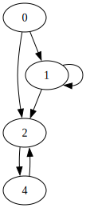
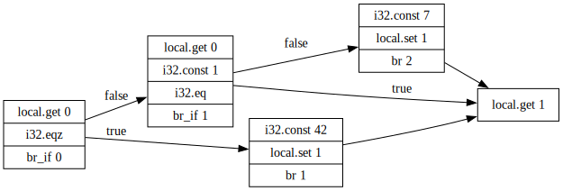

# Overview

## Formatter

Given a file `horrible.wat`:

<details>

<!-- $MDX file=horrible.wat -->
```wat
(module (memory
10) (func
$f (param
     $n i32) (result
i32) (if
             (                       i32.lt_s
        (
local.get $n)
        (
                          i32.const
                          
                          
                          0))
    (  then
(
 
 unreachable)))

    (
     if
( 
i32.lt_s
        (local.get                            $n)
        (i32.const                             2))
    (then          (return (local.get $n)))) (if   
      (i32.eqz   
(i32.load (i32.mul (i32.const 4) (local.get $n)))) (then local.get $n i32.const 4 i32.mul
      (call $f (i32.sub (local.get $n) (i32.const 1)))
      (call $f (i32.sub (local.get $n)
(i32.const 2))) i32.add   i32.store )) local.get $n       i32.const 4 i32.mul i32.load return))
```

</details>

Owi will format it like this:

```sh
$ owi fmt horrible.wat
(module
  (memory 10)
  (func $f (param $n i32) (result i32)
    local.get $n
    i32.const 0
    i32.lt_s
    (if
      (then
        unreachable
      )
    )
    local.get $n
    i32.const 2
    i32.lt_s
    (if
      (then
        local.get $n
        return
      )
    )
    i32.const 4
    local.get $n
    i32.mul
    i32.load 0 align=1
    i32.eqz
    (if
      (then
        local.get $n
        i32.const 4
        i32.mul
        local.get $n
        i32.const 1
        i32.sub
        call $f
        local.get $n
        i32.const 2
        i32.sub
        call $f
        i32.add
        i32.store 0 align=1
      )
    )
    local.get $n
    i32.const 4
    i32.mul
    i32.load 0 align=1
    return
  )
)
```

Are you able to recognize the program now?

## Interpreter

Given a file `42.wat` with the following content:

<!-- $MDX file=42.wat -->
```wat
(module $quickstart
  (func $f
    i32.const 20
    i32.const 22
    i32.add
    drop
  )
  (start $f)
)
```

Running the interpreter is as simple as:

```sh
$ owi run ./42.wat
```

Nothing is happening, so you can add the `-v` option to print an execution trace:

```sh
$ owi run ./42.wat -v
owi: [INFO] parsing      ...
owi: [INFO] checking     ...
owi: [INFO] typechecking ...
owi: [INFO] linking      ...
owi: [INFO] interpreting ...
owi: [INFO] stack         : [  ]
owi: [INFO] running instr : call 0
owi: [INFO] calling func  : func f
owi: [INFO] stack         : [  ]
owi: [INFO] running instr : i32.const 20
owi: [INFO] stack         : [ i32.const 20 ]
owi: [INFO] running instr : i32.const 22
owi: [INFO] stack         : [ i32.const 22 ; i32.const 20 ]
owi: [INFO] running instr : i32.add
owi: [INFO] stack         : [ i32.const 42 ]
owi: [INFO] running instr : drop
```

## Script using the `spectest` module

Given the following `print.wast` file:

<!-- $MDX file=print.wast -->
```wast
(module

  (func $print_i32 (import "spectest" "print_i32") (param i32))

  (func $main
    i32.const 42
    call $print_i32
  )

  (start $main)
)
```

You can print the value thanks to the `print_i32` function imported from the `spectest` module:

```sh
$ owi script ./print.wast
42
```

## Validator

Given a file `type_error.wat` with the following content:

<!-- $MDX file=type_error.wat -->
```wat
(module $quickstart
  (func $f
    i32.const 20
    i32.const 22
    i32.add
    i32.add
    drop
  )
  (start $f)
)
```

Running the validator is as simple as:

```sh
$ owi validate ./type_error.wat
owi: [ERROR] type mismatch (expected [i32 i32] but stack is [i32])
[35]
```

You can also print a more detailed trace with the `-v` option:

```sh
$ owi validate ./type_error.wat -v
owi: [INFO] parsing      ...
owi: [INFO] checking     ...
owi: [INFO] typechecking ...
owi: [ERROR] type mismatch (expected [i32 i32] but stack is [i32])
[35]
```

## Wasm2wat

Given a file `42.wasm`, you can convert it to `result.wat` and then run it:

```sh
$ owi wasm2wat 42.wasm -o result.wat
$ cat result.wat
(module
  (type (func))
  (func
    i32.const 20
    i32.const 22
    i32.add
    drop
  )
  (start 0)
)
$ owi run result.wat -v
owi: [INFO] parsing      ...
owi: [INFO] checking     ...
owi: [INFO] typechecking ...
owi: [INFO] linking      ...
owi: [INFO] interpreting ...
owi: [INFO] stack         : [  ]
owi: [INFO] running instr : call 0
owi: [INFO] calling func  : func anonymous
owi: [INFO] stack         : [  ]
owi: [INFO] running instr : i32.const 20
owi: [INFO] stack         : [ i32.const 20 ]
owi: [INFO] running instr : i32.const 22
owi: [INFO] stack         : [ i32.const 22 ; i32.const 20 ]
owi: [INFO] running instr : i32.add
owi: [INFO] stack         : [ i32.const 42 ]
owi: [INFO] running instr : drop
```

## Wat2wasm

Given a file `42.wat`, you can convert it to `result.wasm` and then run it:

```sh
$ owi wat2wasm 42.wat -o result.wasm
$ owi run result.wasm -v
owi: [INFO] typechecking ...
owi: [INFO] linking      ...
owi: [INFO] interpreting ...
owi: [INFO] stack         : [  ]
owi: [INFO] running instr : call 0
owi: [INFO] calling func  : func anonymous
owi: [INFO] stack         : [  ]
owi: [INFO] running instr : i32.const 20
owi: [INFO] stack         : [ i32.const 20 ]
owi: [INFO] running instr : i32.const 22
owi: [INFO] stack         : [ i32.const 22 ; i32.const 20 ]
owi: [INFO] running instr : i32.add
owi: [INFO] stack         : [ i32.const 42 ]
owi: [INFO] running instr : drop
```

## Call Graph

Given a file `useless.wat` with the following content:

```wat
(module

  (func $start
    i32.const 0
    (if
    (then call $a)
    (else call $b)
    )
  )

  (func $a 
  (block
  call $b)
  call $c)

  (func $b)

  (func $c)

  (start $start))
```

You can then create a file `useless.dot` containing the call graph of the programm:

```sh
$ owi analyze cg useless.wat
```


## Control-Flow Graph

Given a file `useless.wat` with the following content:

```wat
(module
    (func $foo (param i32) (result i32)
       (local i32)
       (block
           (block
               (block
                   local.get 0
                   i32.eqz
                   br_if 0

                   local.get 0
                   i32.const 1
                   i32.eq
                   br_if 1

                   i32.const 7
                   local.set 1
                   br 2)
             i32.const 42
             local.set 1
             br 1)
         i32.const 99
         local.set 1)
       local.get 1)
)
```
You can then create a file `useless.dot` containing the control flow graph of the function foo:

```sh
$ owi analyze cfg useless.wat --entry-point=foo
```




