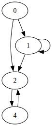
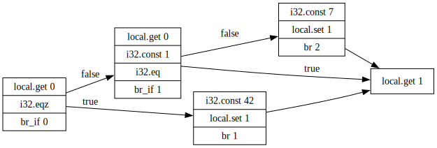

# Program Analyzer

## Call Graph

Given a file `useless.wat` with the following content:

```wat
(module

  (func $start
    i32.const 0
    (if
    (then call $a)
    (else call $b)
    )
  )

  (func $a 
  (block
  call $b)
  call $c)

  (func $b)

  (func $c)

  (start $start))
```

You can then create a file `useless.dot` containing the call graph of the programm:

```sh
$ owi analyze cg useless.wat
```


## Control-Flow Graph

Given a file `useless.wat` with the following content:

```wat
(module
    (func $foo (param i32) (result i32)
       (local i32)
       (block
           (block
               (block
                   local.get 0
                   i32.eqz
                   br_if 0

                   local.get 0
                   i32.const 1
                   i32.eq
                   br_if 1

                   i32.const 7
                   local.set 1
                   br 2)
             i32.const 42
             local.set 1
             br 1)
         i32.const 99
         local.set 1)
       local.get 1)
)
```
You can then create a file `useless.dot` containing the control flow graph of the function foo:

```sh
$ owi analyze cfg useless.wat --entry-point=foo
```


